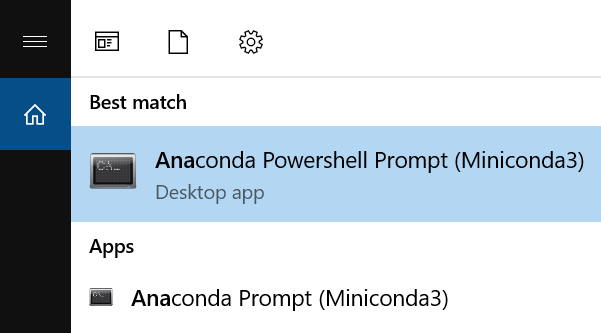

# CS 7643 Final Project - Group 175


This repository contains code, experiments, and other artifacts for CS 7643 Summer 2021 Group 175 Final Project.

### Table of Contents
  - [Prerequisites](#prerequisites)
  - [Working with Git](#git)
  - [Conda](#conda)
  - [Environment](#environment)
  - [Extracting Data](#data)
  - [Preparing Data](#prep)
  - [Logging](#logging)
  - [Training](#training)
  - [Backtesting](#evaluation)
  - [Plotting](#plotting)

<a name="prereq"></a>
## Prerequisites

This project was prepared using [Miniconda (Python3.6)](https://docs.conda.io/en/latest/miniconda.html) for managing the Python environemnt.  


<a name="git"></a>
## Working with Git

Git is a distributed version-control system for tracking changes in source code during software development. It is designed for coordinating work among programmers, but it can be used to track changes in any set of files. Its goals include speed, data integrity, and support for distributed, non-linear workflows.

If you haven't installed Git in your environment go [here](https://git-scm.com/book/en/v2/Getting-Started-Installing-Git).

A Git repository has been created for this project.  To work with it you will need to clone locally the repository.

1. From your IDE or terminal, navigate to the directory you'd like work from and execute:

```
git clone https://github.gatech.edu/dlGroupProject/artifacts.git
```


<a name="conda"/></a>
## Conda


Conda is an open source package and environment management system. Conda quickly installs, runs and updates packages/libraries and easily creates, saves, loads, and switches between environments on your local computer.

You can grab Miniconda [here](https://docs.conda.io/en/latest/miniconda.html). You can access conda via the console, to make sure it's properly installed please run `conda -V` to display the version.

On Windows, to access `conda` via the console please use "Anaconda Prompt" or "Anaconda Powershell Prompt" instead of "Command Prompt".



<a name="env"/></a>
## Environment

Environments are used to keep different python versions and packages isolated from each other, generally each project/application will have an independent python environment. 

1. To create a Python environment simply run:

```
> conda create --name fp python=3.6 -y
```

2. Once it's created you can activate it by running:

```
> conda activate fp
```

3. Finally to run the sample later on, you'll need some packages:

For CPU Only:

```
> conda install pytorch torchvision torchaudio cpuonly -c pytorch
```

If you are running and NVIDIA CUDAble GPU, and have configured CUDA Toolkit 10.2:

```
> conda install pytorch torchvision torchaudio cudatoolkit=10.2 -c pytorch
```

Then add plotting and Panadas:
```
> conda install pandas matplotlib scikit-image
```

Alternatively:
```
> pip install -r requirements.txt
```

To add Jupyter Notebook support:
```
> conda install -c conda-forge notebook nb_conda_kernels jupyterlab nb_conda_kernels jupyter_contrib_nbextensions
```

<a name="data"></a>
## Extracting Data

Data has been prepared and shared [here](https://www.dropbox.com/sh/97451riinhod2t3/AACgi2DJdHgTfm2hdXfiguJ1a?dl=0).  To download and extract the data locally after cloning, navigate to the 'data' directory in your local git repository.

On Windows (this will take a bit):
```
> get_data.bat
```

On Linux (this will take a bit):
```
> ./get_data.sh
```

After extracting the data you can evaluate if your environment is setup correctly but just running the unit tests in the root directory *tests.py*

```
> python tests.py
```

<a name="prep" ></a>
## Preparing the Data

There are two classes largely responsible for preparing the data **PreProcessor** and **ChartDataset**

The **PreProcessor** class is implmented in the file *PreProcessor.py* found in the *data* directory.  The class enumerates the files in the *data/Charts* directory you extracted previously.  It will parse the GICS code, data, and return (ground truth label) from each file.  The results are aggregated into a **Pandas DataFrame**

```python
from data.PreProcessor import PreProcessor

pre_processor = PreProcessor()
df = pre_processor.parse_file_names()
print(df)

```

The **ChartDataset** class is implemented in the file *ChartDataset.py* found in the *data* directory.  The class is derived from **torch.utils.data.Dataset** to conform with the **Pytorch Dataloader**.  This class handles loading the chart images from disk, muting the alpha channel, and labeling them.  Additionally the *train* argument passed to the initializer determines wether the data set is a training or a test split.

```python
import matplotlib.pyplot as plt
from data.ChartDataset import ChartDataset

ds = ChartDataset(PreProcessor())
data, _ = ds[5]
plt.imshow(data)
plt.show()
```

<a name="logging"></a>

## Logging

Logging has been instrumented into the training code for the purpose of archiving training data.  To get a **Logger** instance use the **LoggerFactory** found in the *util* directory in the file *LoggerFactory.py*.  By default log files are output in the *logs* directory.  There is a constant **LOG_DIR** in *./constatns.py* that controls the location.

```python
from utils.LoggerFactory import LoggerFactory

logger = LoggerFactory.create_logger('Trainer', 'resnet32_alpha0.01_momentum.9.log')

```

<a name="training"></a>

## Training
If you're good to go, then take a look at *experiments.py* to start training.  It will perform a grid search on a dictionary of hyperparemeters and models.  See the **__init__()** method in *./Trainer.py*.

```python
from GridSearch import GridSearch
from models.resnet import resnet20, resnet32, resnet44
from utils.evaluation_functions import trainer_eval
from utils.LoggerFactory import LoggerFactory

def main():
    try:  
        grid = GridSearch(trainer_eval)
        grid({'model':[(resnet20(), 'resnet20'), (resnet32(), 'resnet32'), (resnet44(), 'resnet44')],
              'epochs':[1],
              'regularization_parameter':[1e-4], 
              'batch_size':[32],              
              'thresholds':[0]}) #lets just see if we can get it to pick up or down to start
    except Exception as e:
        LoggerFactory.create_logger('Main', 'main.log').exception(e, exc_info=True)
        
if __name__ == '__main__':
    main()
```

<a name="evaluation"></a>

## Backtesting
Currently there is a *backtest/marketsimcode.py* file written by Pecka, containing some utility methods for calculating daily returns, etc. used for ML4T (CS 7643).
TODO: Dig up code form ML4T (daily returns)

<a name="plotting"></a>

## Plotting
Currently there is a *utils/Plotter.py* file written by Pecka, containing some plottinng methods used for ML (CS 7641)
TODO: add Plotter with methods for learning curves, etc...

TODO:
Test Biggest Image Size we can get to work in Colab
Sanity Checks - verify per class accuracy, calc bin distributions in holdout set
Run overnight on Colab  
Create Predictor Class that given an image file outputs: {GICS, Timestamp, Prediction}
Serialize to CSV (probably just output a Dataframe and call to_csv() )

TRAIN TRAIN TAIN - Grad Student Compute Grid

Sparse Image Representation 
    An 800x600 image has 480,000 pixels, but the majority are white (emtpy).  
    These 4.8x10^5 are using 32 bit floats x 3 channels (RGB) in memory.
    We only used two colors Red and Green in the chart so we could represent 
    The whole image  with 2 (4.8x10^5) bit arrays with 0s being white and 1s 
    being R or G.  It would be great if we could figure out how to leverage
    this in training.